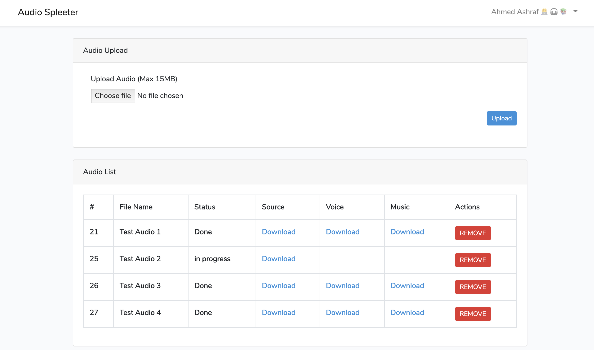

# Audio Spleeter
A web interface built with laravel & VueJS interacting with [Dezzer/Spleeter](https://github.com/deezer/spleeter) to split audio files into Vocals (singing voice) / accompaniment separation and some other options



# Prerequisites
- Pusher account (https://pusher.com)

# Source Code
The files you need to check in order to have a better understanding of how the project works
```
- project path
	-- App
		-- Jobs
			-- AudioSplit.php
		-- Events
			-- AudioStatusUpdate.php
			-- AudioUploaded.php
		-- Http
			-- Controllers
				-- AudioController.php
		-- Scripts
			-- Distributor.php
			-- Splitter.php
			-- Merger.php
		-- Shell
			-- ShellOutput.php
```
# Install & Run
it uses docker so it should be easy to have it running quickly

- `$ docker-compose build`
- `$ docker-compose up`

then in another terminl window

- `$ docker exec -it audio-spletter_app_1 composer install`
- `$ cp .env.example .env` **and setup missing variables**
- `$ docker exec -it audio-spletter_app_1 php artisan migrate`
- `$ docker exec -it audio-spletter_app_1 npm install`
- `$ docker exec -it audio-spletter_app_1 npm run dev` **to build VueJS**
- `$ docker exec -it audio-spletter_app_1 php artisan artisan queue:work --timeout=600 --memory=500` **to run workers**

# Bugs
if you have any issues with it feel free to open an issue or even a PR if you have a fix

# Licenses
It's free so feel free to do whatever you want to do with it. also don't forget to check [Dezzer/Spleeter's Licences](https://github.com/deezer/spleeter/blob/master/LICENSE)
